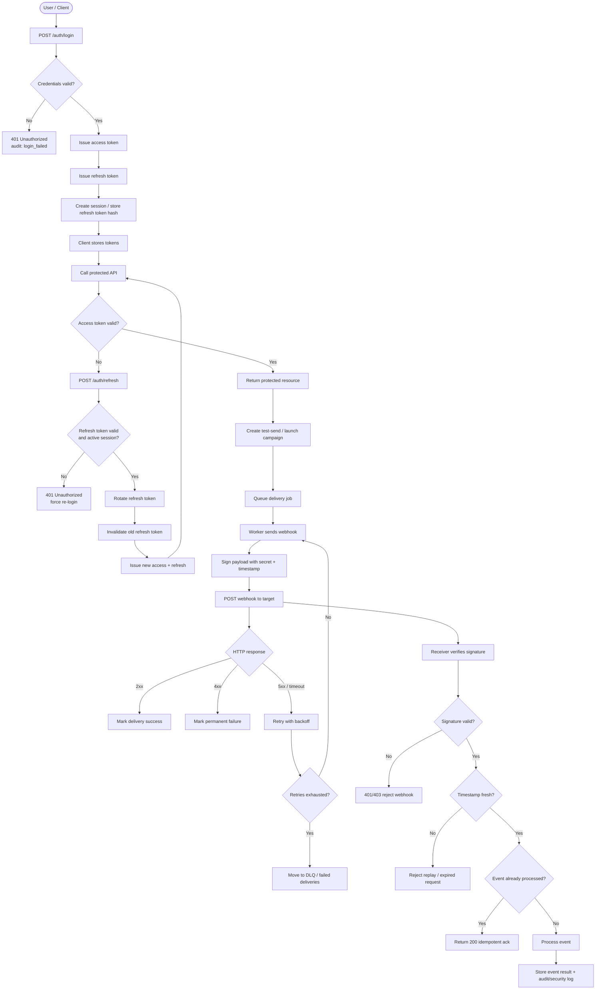

# NotifyHub
Мультиарендная дырявая SaaS для управления уведомлениями. Используется в учебных целях CI/CD, AppSec и немного 
разработки.

Пользователь создаёт "кампании", шаблоны сообщений, список получателей, webhook endpoints и API keys; затем запускает 
тестовую отправку и смотрит историю delivery attempts.

## Цели проекта
1. Демонстрация пути **код → CI/CD → сканирование → деплой**
2. Отработка на практике:
   1. Внедрение SAST, SCA, DAST, сканирование секретов и контейнеров.
   2. Работа с OWASP API Security Top 10 - создание и устранение уязвимостей
   3. Docker-харденинг, k8s (RBAC, NetworkPolicy), IaC, мониторинг и логирование.

## Используемый стек
- Backend: Python/FastAPI
- БД: PostgreSQL
- ORM: SQLAlchemy
- Обработчик очередей: Redis
- Docker Compose

## Компоненты
- `apps/api` - FastAPI API, HTTP-эндпоинты, аутентификация/авторизация.
- `apps/worker` - фоновая обработка отправок
- `db` - миграции (Alembic), схема (SQLAlchemy).
- `infra/` - Docker, k8s манифесты.
- `docs/` - вся документация по проекту от ТЗ и модели угроз до 

## Потоковая диаграмма 

## Итеративный подход
Проект должен содержать три итерации:
1. Реализация основного функционала, но содержит демонстрационные уязвимости.
2. Добавление базового контроля безопасности, устранение ключевых уязвимостей.
3. Харденинг и безопасность платформы.

## О применении ИИ
В данном проекте ИИ используется для формирования и формализации общей идеи и спецификации технического задания. 
При этом, ИИ не используется для описания модели угроз, RBAC-матрицы, описания контроля безопасности.

ИИ не применяется для разработки исходного кода и пайплайнов для прозрачности демонстрации и честности самого обучения.
Исключение: дизайн и фронтенд, которые могут использоваться для демонстрации